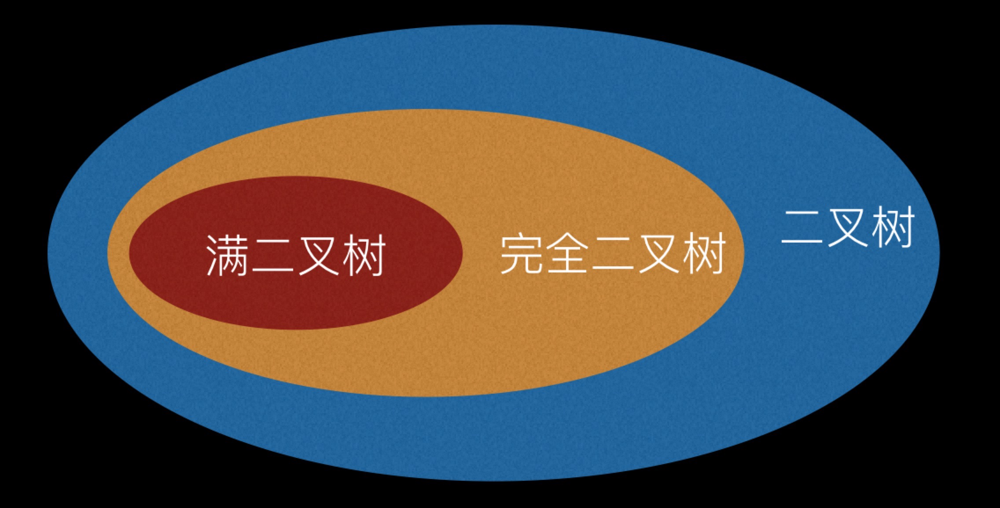

## 树

#### 基础公式

- 等比数列求和公式： (a1-an*q)/(1-q) = a1(1-q^n)/(1-q)

#### 1. 二叉树

定义：二叉树是每个节点最多有两个子树的树结构。

结论：

如果一颗树深度为d，最大层数为k。

1. 第i层最多有2^(i-1)个结点。
2. 层数为k的二叉树最多有2^k-1个结点。
3. 如果叶子节点数为n0，度数为2的结点数为n2，则n0=n2+1(从`2xn2+1xn1+0xn0+1=n2+n1+n0`推导出来)
4. 一棵深度为k，且有2^k-1个节点称之为满二叉树；深度为k，有n个节点的二叉树，当且仅当其每一个节点都与深度为k的满二叉树中，序号为1至n的节点对应时，称之为完全二叉树。

#### 2. 满二叉树

* 国内定义： 除最后一层无任何子节点外，每一层上的所有结点都有两个子结点二叉树。

结论：

如果一颗树深度为d，最大层数为k。

1. 它的叶子数是： 2^d
2. 总节点数是： 2^k-1 (2的k次方减一)
3. 总节点数一定是奇数。
4. 第k层的节点数是： 2^(k-1)

* 国外定义： 满二叉树的任意节点，要么度为0，要么度为2。

>“满二叉树(full)”的定义在国内和国外完全不同，国内指“完美二叉树(perfect)”，国外指“正则二叉树(strict)”，所以我建议国内外都取消“满二叉树(full)”这个叫法，这样就没有不必要的麻烦了。

#### 3. 完全二叉树

定义：只有最下面的两层结点度能够小于2，并且最下面一层的结点都集中在该层最左边的若干位置的二叉树。

完全二叉树通常采用数组而不是链表存储,其存储结构如下:

`var tree:array[1..n]of longint;{n:integer;n>=1}`

对于tree[i]，有如下特点：

1. 若i为奇数且i>1，那么tree的左兄弟为tree[i-1]；
2. 若i为偶数且i<n，那么tree的右兄弟为tree[i+1]；
3. 若i>1，tree的双亲为tree[i div 2]；
4. 若2*i<=n，那么tree的左孩子为tree[2*i]；若2*i+1<=n，那么tree的右孩子为tree[2*i+1]；
5. 若i>n div 2,那么tree[i]为叶子结点（对应于（3））；
6. 若i<(n-1) div 2.那么tree[i]必有两个孩子（对应于（4））。
7. 满二叉树一定是完全二叉树，完全二叉树不一定是满二叉树。
8. 完全二叉树第i层至多有2^（i-1）个节点，共i层的完全二叉树最多有2^i-1个节点。

完全二叉树的特点是：
1. 只允许最后一层有空缺结点且空缺在右边，即叶子结点只能在层次最大的两层上出现；
2. 对任一结点，如果其右子树的深度为j，则其左子树的深度必为j或j+1。 即度为1的点只有1个或0个

#### 4. 平衡二叉树

定义：它是一棵空树或它的左右两个子树的高度差的绝对值不超过1，并且左右两个子树都是一棵平衡二叉树。

#### 5. 二叉搜索树

定义：二叉搜索树（Binary Search Tree），（又：二叉查找树，二叉排序树）它或者是一棵空树，或者是具有下列性质的二叉树： 若它的左子树不空，则左子树上所有结点的值均小于它的根结点的值； 若它的右子树不空，则右子树上所有结点的值均大于它的根结点的值； 它的左、右子树也分别为二叉搜索树。

二叉排序树的查找过程通常采取二叉链表作为二叉排序树的存储结构。中序遍历二叉排序树可得到一个关键字的有序序列，一个无序序列可以通过构造一棵二叉排序树变成一个有序序列，构造树的过程即为对无序序列进行排序的过程。每次插入的新的结点都是二叉排序树上新的叶子结点，在进行插入操作时，不必移动其它结点，只需改动某个结点的指针，由空变为非空即可。搜索,插入,删除的复杂度等于树高，O(log(n))。

##### 5.1 添加

##### 5.2 查找

##### 5.3 范围查找

##### 5.4 删除

### 总结

