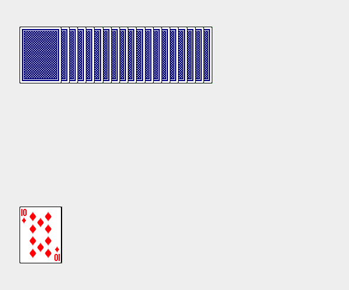
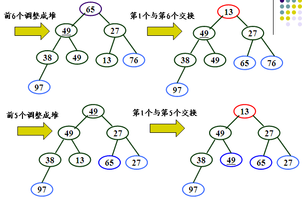
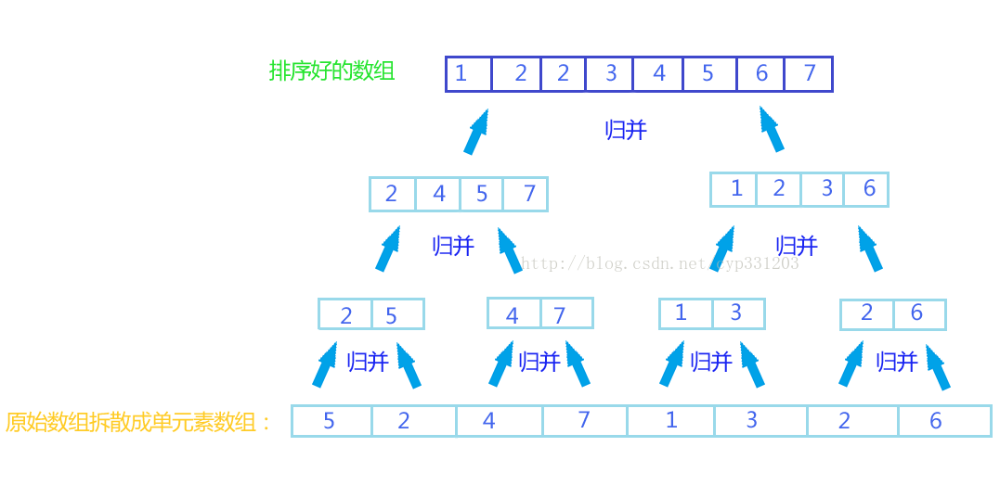
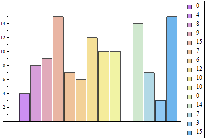
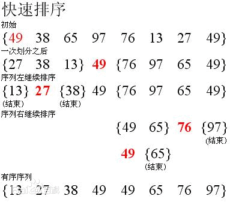
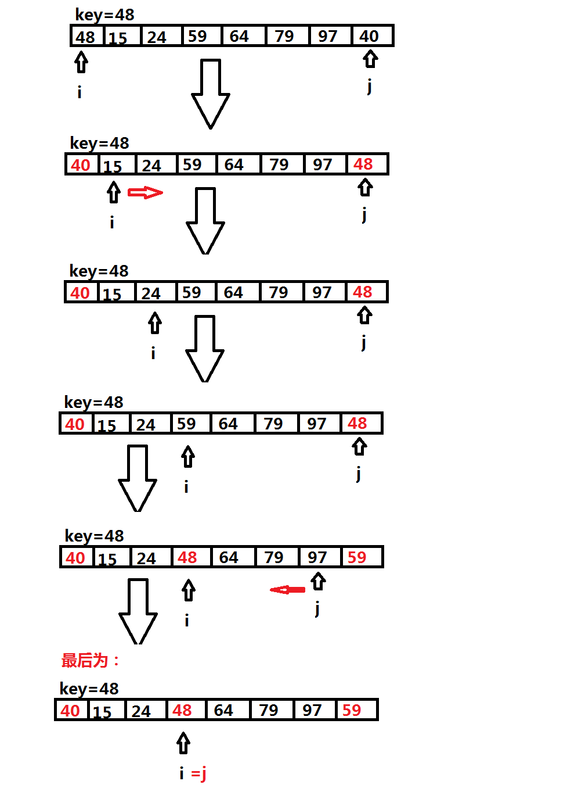
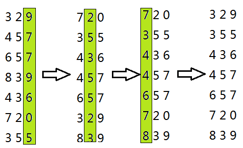

## 排序

符号：Θ

```
log是以任何数为底
lg是以10为底
ln是以e为底
```

- 插入排序
- 选择排序
- 堆排序
- 归并排序
- 冒泡排序
- 快速排序
- 桶排序
- 基数排序
- 计数排序

### 插入排序

**插入排序（Insertion Sort）**是一种简单的插入排序法，其基本思想是：把待排序的元素按其关键码值的大小逐个插入到一个已经排好序的有序序列中，直到所有的元素插入完为止，得到一个新的有序序列。

#### 比喻

莫扑克牌，开始时，左手为空并且桌子上的牌面向下，然后每次从牌堆最上面拿走一张牌，插入到左手的正确位置上。




#### 性质

- 最好时间复杂度 : Θ(n)
- 平均时间复杂度 : Θ(n²)
- 最差时间复杂度 : Θ(n²)
- 空间复杂度 : Θ(1)
- 稳定性 : 稳定

#### 伪代码

```
void insertSort(int array[],int length)
{
    for (int i = 1; i < length; i++) {
        int temp = array[i];
        int j = i;
        for (; j > 0; j--) {
            if (array[j-1] > temp) {
                array[j] = array[j-1];
            }else{
                break;
            }
        }
        array[j] = temp;
    }
}
```

递归式：为了排序A[0..k],我们递归地排序A[0...k-1]，然后把A[k]插入到已排序的数组A[0...k-1]中。

```
void recursiveInsertSort(int array[], int length, int cur)
{
	if (cur < 1)
	{
		return;
	}
	//递归前一个数组
	recursiveInsertSort(array, length, cur-1);

	int value = array[cur];
	int j = cur;
	for (; j > 0; j--)
	{
		if (array[j-1] > value){
			array[j] = array[j-1];
		}else{
			break;
		}
	}
	array[j] = value;
}
```

### 选择排序

**选择排序（Selection Sort）**的工作原理是每一次从待排序的数据元素中选出最小（或最大）的一个元素，与待排序序列起始位置的元素交换，直到全部待排序的数据元素排完。


#### 性质

- 最好时间复杂度 : Θ(n²)
- 平均时间复杂度 : Θ(n²)
- 最差时间复杂度 : Θ(n²)
- 空间复杂度 : Θ(1)
- 稳定性 : 不稳定

#### 伪代码

```
void selectionSort(int array[], int length)
{
	for (int i = 0; i < length-1; ++i)
	{
		int min = i;
		for (int j = i+1; j < length; ++j)
		{
			if (array[min] > array[j]){
				min = j;
			}
		}

		if (min != i){
			int temp = array[i];
			array[i] = array[min];
			array[min] = temp;
		}
	}
}
```

### 堆排序

**堆排序（Heap Sort）**指利用堆积树（堆）这种数据结构所设计的一种排序算法，它是选择排序的一种。

- 堆分为大根堆（k[i]>=k[2i],k[i]>=k[2i+1]）和小根堆（k[i]<=k[2i],k[i]<=k[2i+1]）。(i=1,2,3...⎣n/2⎦)
- 堆是完全二叉树。

实现堆排序要解决两个问题：

1. 将n个待排序的数建成堆。
2. 输出堆顶元素后，调整剩余元素，成为一个新堆。



解决：

问题一：从最后一个非叶子节点（k[⎣n/2⎦]）开始的子树，使之成为堆，依次向前，直到根节点。

问题二：将堆顶输出，最后一个节点换到堆顶，堆被破坏。从堆顶开始，与左右结点中较小（或较大）的元素交换。继续对不满足堆性质的子树进行交换，直到使之成为堆。

#### 性质

- 最好时间复杂度 : Θ(nlogn)
- 平均时间复杂度 : Θ(nlogn)
- 最差时间复杂度 : Θ(nlogn)
- 空间复杂度 : Θ(1)
- 稳定性 : 不稳定

#### 伪代码

```
//注意：这里的i=（1,2,3...n）
void heapSort(int array[], int length)
{
	buildHeap(array, length);
	for (int i = length; i >= 1; i--)
	{
		//交换第一个元素和最后一个元素，即每次将堆顶元素排到未排好序列的最后
		int temp = array[0];	
		array[0] = array[i-1];
		array[i-1] = temp;
		//重新调整为堆
		heapAdjust(array, i-1, 1); 
	}
}

///调整以i结点为根的树为堆
void heapAdjust(int array[], int length, int i)
{
	int lChild = i*2;
	int rChild = i*2 + 1;
	int maxIndex = i;
	//处理非叶子节点
	if (i <= length/2) 
	{
		if (lChild <= length && array[lChild-1] > array[maxIndex-1])
		{
			maxIndex = lChild;
		}
		if (rChild <= length && array[rChild-1] > array[maxIndex-1])
		{
			maxIndex = rChild;
		}
		if (maxIndex != i)
		{
			int temp = array[maxIndex-1];
			array[maxIndex-1] = array[i-1];
			array[i-1] = temp;
			heapAdjust(array, length, maxIndex);
		}
	}
}

///创建堆
void buildHeap(int array[], int length)
{
	//从最后一个非叶子结点开始，调整为堆
	for (int i = length/2; i >= 1; i--)
	{
		heapAdjust(array, length, i);
	}
}
```

### 归并排序

**归并排序（Merge Sort）**是将已有序的子序列合并，得到完全有序的序列；即先使每个子序列有序，再使子序列段间有序。是建立在归并操作上的一种有效的排序算法,该算法是采用分治法（Divide and Conquer）的一个非常典型的应用。



#### 性质

- 最好时间复杂度 : Θ(nlogn)
- 平均时间复杂度 : Θ(nlogn)
- 最差时间复杂度 : Θ(nlogn)
- 空间复杂度 : Θ(n)
- 稳定性 : 稳定

#### 伪代码

```
void mergeSort(int array[], int tempArray[], int low, int high)
{
	if (low >= high){
		return;
	}

	//递归前半段、后半段
	int mid = (low + high) / 2;
	mergeSort(array, tempArray, low, mid);
	mergeSort(array, tempArray, mid + 1, high);

	int i = low;
	int j = mid + 1;
	int cur = 0;
	while(i <= mid && j <= high)
	{
		if (array[i] < array[j]){
			tempArray[cur] = array[i++];
		}else{
			tempArray[cur] = array[j++];
		}
		cur++;
	}

	while(i <= mid)
	{
		tempArray[cur++] = array[i++];
	}

	while(j <= high)
	{
		tempArray[cur++] = array[j++];
	}

	for (int i = 0; i < cur; ++i)
	{
		array[i+low] = tempArray[i];
	}
}
```

### 冒泡排序

**冒泡排序（Bubble Sort）**在要排序的一组数中，对当前还未排好序的范围内的全部数，自上而下对相邻的两个数依次进行比较和调整，让较大的数往下沉，较小的往上冒。



#### 性质

- 最好时间复杂度 : Θ(n)
- 平均时间复杂度 : Θ(n²)
- 最差时间复杂度 : Θ(n²)
- 空间复杂度 : Θ(1)
- 稳定性 : 稳定

#### 伪代码

```
void bubbleSort(int array[], int length)
{
	for (int i = 0; i < length-1; ++i)
	{
		for (int j = 0; j < length-1-i; ++j)
		{
			if (array[j] > array[j+1])
			{
				int temp = array[j];
				array[j] = array[j+1];
				array[j+1] = temp;
			}
		}
	}
}
```

#### 改进

1.设置一标志性变量pos,用于记录每趟排序中最后一次进行交换的位置。由于pos位置之后的记录均已交换到位,故在进行下一趟排序时只要扫描到pos位置即可。

```
void bubbleSort1(int array[], int length)
{
	for (int i = length - 1; i > 0;)
	{
		int pos = 0;
		for (int j = 0; j < i; ++j)
		{
			if (array[j] > array[j+1])
			{
				int temp = array[j];
				array[j] = array[j+1];
				array[j+1] = temp;
				pos = j;
			}
		}
		i = pos;
	}
}
```

2.传统冒泡排序中每一趟排序操作只能找到一个最大值或最小值,我们考虑利用在每趟排序中进行正向和反向两遍冒泡的方法一次可以得到两个最终值(最大者和最小者) , 从而使排序趟数几乎减少了一半。

```
void bubbleSort2(int array[], int length)
{
	int low = 0;
	int high = length - 1;
	while(low < high){
		for (int j = low; j < high; j++)
		{
			//正向冒泡
			if (array[j] > array[j+1])
			{
				int temp = array[j];
				array[j] = array[j+1];
				array[j+1] = temp;
			}
		}
		high--;
		for (int j = high; j > low; j--)
		{
			//反向冒泡
			if (array[j-1] > array[j])
			{
				int temp = array[j];
				array[j] = array[j-1];
				array[j-1] = temp;
			}
		}
		low++;
	}
}
```

### 快速排序

**快速排序（Quick Sort）**是对冒泡排序的一种改进。通过一趟排序将要排序的数据分割成独立的两部分，其中一部分的所有数据都比另外一部分的所有数据都要小，然后再按此方法对这两部分数据分别进行快速排序，整个排序过程可以递归进行，以此达到整个数据变成有序序列。





#### 性质

- 最好时间复杂度 : Θ(nlogn)
- 平均时间复杂度 : Θ(nlogn)
- 最差时间复杂度 : Θ(n²)
- 空间复杂度 : Θ(1)
- 稳定性 : 不稳定

#### 伪代码

```
void quickSort(int array[], int low, int high)
{
	if (low >= high)
	{
		return;
	}
	int i = low;
	int j = high;
	int cur = array[i];
	int curIndex = i;
	while(i < j){
		cur = array[i];
		curIndex = i;
		while(curIndex < j && array[j] >= cur) j--;
		array[curIndex] = array[j];
		array[j] = cur;
		curIndex = j;
		while(i < curIndex && array[i] <= cur) i++;
		array[curIndex] = array[i];
		array[i] = cur;
		curIndex = i;
	}
	quickSort(array, low, curIndex-1);
	quickSort(array, curIndex+1, high);
}
```

#### 改进

快速排序是通常被认为在同数量级（O(nlogn)）的排序方法中平均性能最好的。但若初始序列按关键码有序或基本有序时，快排序反而蜕化为冒泡排序。

1.为改进之，通常以“三者取中法”来选取基准记录，即将排序区间的两个端点与中点三个记录关键码居中的调整为支点记录。

```
void quickSort1(int array[], int low, int high)
{
	if (low >= high)
	{
		return;
	}
	int i = low;
	int j = high;
	int cur = array[i];
	int curIndex = i;
	while(i < j){
		//前后中三点取中 start
		cur = array[i];
		curIndex = i;
		int max = array[i];
		int maxIndex = i;
		int min = array[i];
		int minIndex = i;
		if (array[i] > array[j])
		{
			min = array[j];
			minIndex = j;
		}else{
			max = array[j];
			maxIndex = j;
		}

		if (min > array[(i+j)/2])
		{
			cur = min;
			curIndex = minIndex;
		}else if (max < array[(i+j)/2])
		{
			cur = max;
			curIndex = maxIndex;
		}else{
			cur = array[(i+j)/2];
			curIndex = (i+j)/2;
		}
		//前后中三点取中 end

		while(curIndex < j && array[j] >= cur) j--;
		array[curIndex] = array[j];
		array[j] = cur;
		curIndex = j;
		while(i < curIndex && array[i] <= cur) i++;
		array[curIndex] = array[i];
		array[i] = cur;
		curIndex = i;
	}
	quickSort1(array, low, curIndex-1);
	quickSort1(array, curIndex+1, high);
}
```

2.还有一种改进方法，对长度大于k的序列递归调用排序，使序列基本有序，然后再用插入排序使序列完全有序。（因为快速排序对基本有序的序列排序慢，而插入排序对基本有序的序列排序快，两者配合）一般k取值为8的时候效果最佳。

```
void quickSort2(int array[], int low, int high)
{
	if (low >= high)
	{
		return;
	}

	int k = 8;
	int i = low;
	int j = high;
	if (j - i < k)
	{
		//序列小于k，使用插入排序
		for (int x = i+1; x <= j; x++)
		{
			int value = array[x];
			int y = x;
			for (; y > i; y--)
			{
				if (array[y-1] > value)
				{
					array[y] = array[y-1];
				}else{
					break;
				}
			}
			array[y] = value;
 		}
	}else{
		//序列大于k，使用快速排序
		int cur = array[i];
		int curIndex = i;
		while(i < j){
			cur = array[i];
			curIndex = i;
			while(curIndex < j && array[j] >= cur) j--;
			array[curIndex] = array[j];
			array[j] = cur;
			curIndex = j;
			while(i < curIndex && array[i] <= cur) i++;
			array[curIndex] = array[i];
			array[i] = cur;
			curIndex = i;
		}
		quickSort2(array, low, curIndex-1);
		quickSort2(array, curIndex+1, high);
	}
}
```

### 桶排序

**桶排序(Bucket sort)**或所谓的箱排序，是一个排序算法，工作的原理是将数组分到有限数量的桶子里。每个桶子再个别排序（有可能再使用别的排序算法或是以递归方式继续使用桶排序进行排序）。


### 基数排序

基数排序的方式可以采用**LSD（Least sgnificant digital）**或**MSD（Most sgnificant digital）**，LSD的排序方式由键值的最右边开始，而MSD则相反，由键值的最左边开始。LSD的基数排序适用于位数小的数列，如果位数多的话，使用MSD的效率会比较好，MSD的方式恰与LSD相反，是由高位数为基底开始进行分配，其他的演算方式则都相同。 

#### LSD

待排序序列:

73, 22, 93, 43, 55, 14, 28, 65, 39, 81

##### 第一步

首先根据个位数的数值，在走访数值时将它们分配至编号0到9的桶子中：

```
0
1 81
2 22
3 73 93 43
4 14
5 55 65
6
7
8 28
9 39
```
##### 第二步

接下来将这些桶子中的数值重新串接起来，成为以下的数列：

81, 22, 73, 93, 43, 14, 55, 65, 28, 39

接着再进行一次分配，这次是根据十位数来分配：

```
0
1 14
2 22 28
3 39
4 43
5 55
6 65
7 73
8 81
9 93
```

##### 第三步
接下来将这些桶子中的数值重新串接起来，成为以下的数列：

14, 22, 28, 39, 43, 55, 65, 73, 81, 93

#### MSD

待排序序列:

170, 45, 75, 90, 2, 24, 802, 66

##### 第一步

我们看到，这里面的最大的数是3位数。所以说我们开始从百位对这些数进行分组

```
0: 045, 075, 090,002, 024, 066
1: 170
2-7: 空
8: 802
9: 空
```

##### 第二步

从这里开始就和LSD基数排序有差别了。在LSD基数排序中，每次分好组以后开始对桶中的数据进行收集。然后根据下一位，对收集后的序列进行分组。而对于MSD，在这里不会对桶中的数据进行收集。我们要做的是检测每个桶中的数据。当桶中的元素个数多于1个的时候，要对这个桶递归进行下一位的分组。

在这个例子中，我们要对0桶中的所有元素根据十位上的数字进行分组

```
0: 002
1: 空
2: 024
3: 空
4: 045
5: 空
6: 066
7: 075
8: 空
9: 090
```

按照上面所说，我们应该再递归的对每个桶中的元素根据个位上的数进行分组。但是我们发现，现在在每个桶中的元素的个数都是小于等于1的。因此，到这一步我们就开始回退了。也就是说我们开始收集桶中的数据。收集完成以后，回退到上一层。此时按照百位进行分组的桶变成了如下的形式:

```
0: 002, 024, 045,066, 075, 090
1: 170
2-7: 空
8: 802
9: 空
```

##### 第三步

然后我们在对这个桶中的数据进行收集。收集起来以后序列如下：

2, 24, 45, 66, 75, 90, 170, 802

#### 基数排序的复杂度分析

设待排序列为n个记录，d个关键码，关键码的取值范围为radix，则进行链式基数排序的时间复杂度为O(d(n+radix))，其中，一趟分配时间复杂度为O(n)，一趟收集时间复杂度为O(radix)，共进行d趟分配和收集。

<!---->

### 复杂度

